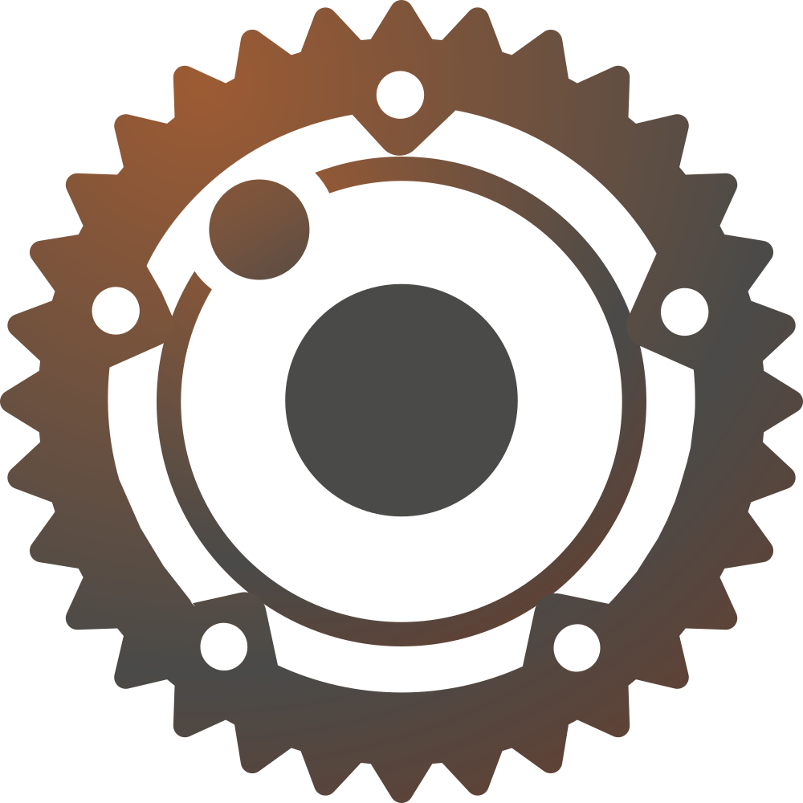

# Orbit UI Framework Ecosystem

<p align="center">
  
</p>

<p align="center">
  <a href="https://github.com/orbitrs/orbit/actions/workflows/ci.yml">
    
  </a>
  <a href="https://crates.io/crates/orbiton">
    
  </a>
  <a href="https://github.com/orbitrs/orbit/blob/main/LICENSE-MIT">
    
  </a>
</p>

Orbit is a next-generation Rust-first, cross-platform UI framework for building Web, Native, and Embedded applications using a unified component format.

## Features

- **Unified Component Format** - Write components once, run everywhere using `.orbit` files
- **Performance-Focused** - Built in Rust for optimal performance and memory safety
- **Cross-Platform** - Targets web, desktop, mobile, and embedded platforms
- **Reactive State Management** - Efficient state updates and rendering optimizations
- **Modern Developer Experience** - Hot reloading, developer tools, and static analysis

## Project Structure

The Orbit ecosystem consists of the following components:

- **[orbit](./orbit)**: The core Orbit UI framework - provides the rendering engine, component model, and framework APIs
- **[orbit-analyzer](./orbit-analyzer)**: Static analysis tool for `.orbit` files - ensures code quality and best practices
- **[orbitkit](./orbitkit)**: Pre-built component library with UI elements and utilities
- **[orbiton](./orbiton)**: CLI tooling for project management, development, and deployment

## Getting Started

```bash
# Install the CLI tool
cargo install orbiton

# Create a new Orbit project
orbiton new my-app
cd my-app

# Start development server
orbiton dev
```

## Component Example

Orbit uses a single file component format with template, style, and script sections:

```
<template>
  <div class="counter">
    <h2>{{ title }}</h2>
    <div class="counter-display">{{ count }}</div>
    <div class="counter-controls">
      <button @click="increment">+</button>
      <button @click="decrement">-</button>
      <button @click="reset">Reset</button>
    </div>
  </div>
</template>

<style>
.counter {
  font-family: Arial, sans-serif;
  max-width: 300px;
  margin: 0 auto;
  padding: 20px;
  border: 1px solid #ddd;
  border-radius: 8px;
}
/* ...more styles... */
</style>

<script>
use orbit::prelude::*;

pub struct Counter {
    title: String,
    count: i32,
    initial: i32,
}

impl Component for Counter {
    type Props = CounterProps;
    
    fn new(props: Self::Props) -> Self {
        let initial = props.initial.unwrap_or(0);
        Self {
            title: props.title,
            count: initial,
            initial,
        }
    }
    
    // render() is auto-generated from the template
}

// ...component methods...
</script>
```

## Development Setup

1. Clone this repository:
   ```bash
   git clone https://github.com/orbitrs/orbit.git
   cd orbit
   ```

2. Build all projects:
   ```bash
   cargo build --workspace
   ```

3. Run tests:
   ```bash
   cargo test --workspace
   ```

## Documentation

- [Architecture Overview](./docs/architecture.md) - Framework architecture and design
- [Component Specification](./orbit/orbit-spec.md) - `.orbit` file format and component API
- [Getting Started Guide](./docs/getting-started/README.md) - Tutorials for new users
- [API Docs](./docs/api/README.md) - API reference and guides
- [Examples](./examples) - Example applications and components
- [Roadmap](./docs/roadmap/README.md) - Development roadmap and milestones

## Rendering Backends

Orbit supports multiple rendering backends:

- **Skia** - High-performance 2D graphics (default)
- **WGPU** - Hardware-accelerated graphics via WebGPU API
- **Web** - DOM-based rendering for web applications
- **Custom** - Extensible renderer API for custom backends

## Platform Support

Current:
- Desktop (Windows, macOS, Linux)
- Web (via WebAssembly)

Planned:
- Mobile (iOS, Android)
- Embedded

## License

This project is licensed under either:

- [MIT License](LICENSE-MIT)
- [Apache License, Version 2.0](LICENSE-APACHE)

at your option.
- View our development roadmap and milestones in the [roadmap](./docs/roadmap) directory

## Contributing

Please see our [CONTRIBUTING.md](./CONTRIBUTING.md) for guidelines on how to contribute to the Orbit ecosystem.

## License

This project is licensed under either:

- [MIT License](./LICENSE-MIT)
- [Apache License, Version 2.0](./LICENSE-APACHE)

at your option.
